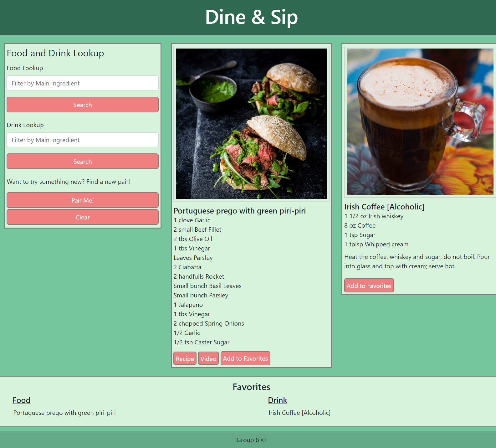

# Food and Drink Pairings
[Link to My Project](https://zoerorvig.github.io/food-and-drink-pairings/)

## Table of Contents
- [Description](#description)
- [Visuals](#visuals)

## Description 
This webpage presents a simple food and drink pairing app for use when you are undecided on what to eat or drink for the day. Use responsibly.

Features Include:
-   A form to search for food and drink.
-   Option to create a random pair.
-   Links to recipe and video.
-   Displays ingredients for food. 
-   Displays instructions and ingredients for drink.
-   Option to add/save favorites.
-   Produces images of food and drink upon lookup.

## Technologies Used 
HTML, CSS, JavaScript

## Visuals 

The following is a screenshot of the whole page:

The following is a another screenshot of the whole page:

The following gif is to show functionality of the webpage:

